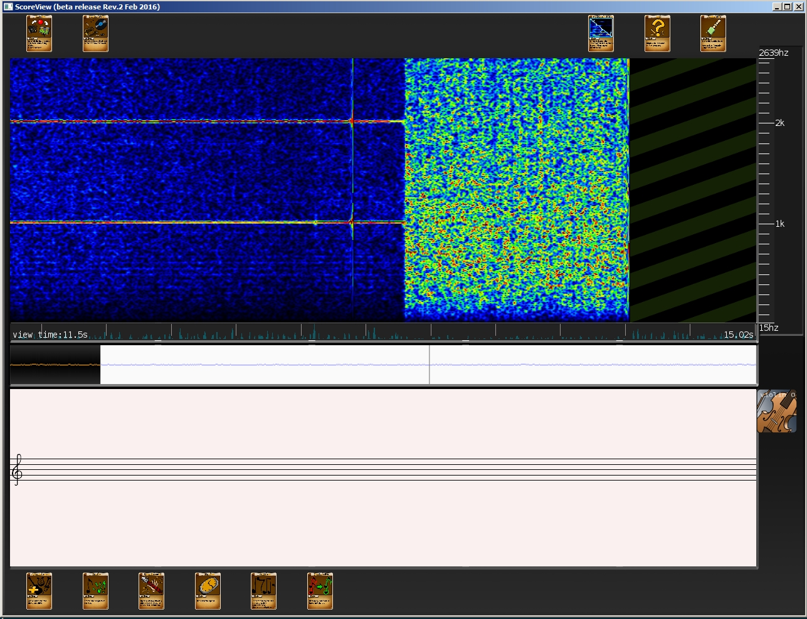

# Scoreview-Base

Scoreview is a tool to analyse music and learn how to play it on various instruments.
Mostly a proof of concept, using the GPU to visualise sound in real time.
At the begining of it, I really though it would be amazing and it is. But the technological choices
were weird. However it is a nice tool to visually analyse sounds.

## Crasy choice and over ambition

The software is portable, I even wanted to compile it on android native before understanding Android was trash in 2015.
I do ont know the state of Android native now but I would not try to know.
I used OpenCL, and OpenCL is a semi failure because of a voluntary lack of support from the industry.

The application is made of TCP/IP servers using protocol buffers.
You could run each window on another machine. And this was really crasy.

## Command to build it:

```
make project
```

The program uses OpenCL to process sound, so you need to install OpenCL support for your GPU.

It needs a lot of dependecies: SDL2, SDL2_ttf, SDL2_image, SDL2_net, SDL2_gfx, glew, Portaudio, Tinyxml, libevent, libsndfile, OpenGL, glm, OpenCL, FLTK, Protocol buffers and DSPFilters as a submodule.

On windows they can be installed with pacman on MSys, be carefull about the 64 or 32 in mingw64/32.
However you need to use mingw64 to compile and be sure that in your shell "gcc -dumpmachine" gives "x86_64-w64-mingw64".
I use Nvidia OpenCL, despite the fact that OpenCL2 is not suported by Nvidia, their OpenCL frontend is great.

## Examples

```
pacman -Ss SDL2
pacman -S mingw64/mingw-w64-x86_64-SDL2 mingw64/mingw-w64-x86_64-SDL2_image mingw64/mingw-w64-x86_64-SDL2_ttf

pacman -Ss protobuf
pacman -S mingw64/mingw-w64-x86_64-protobuf
pacman -S msys/protobuf-devel

pacman -S mingw64/mingw-w64-x86_64-opencl-headers
```

For windows you should point to the correct gcc:

```
pacman -S --needed base-devel mingw-w64-x86_64-toolchain
pacman -Sy mingw-w64-x86_64-gcc
pacman -Sy mingw-w64-x86_64-headers-git
```

Otherwise, the headers will conflict for Winsock.

On linux, just install the dev packages for the libraries mentioned above.



## Copyright

Code by Patrick Areny, as 2/7/2021 no contributions yet.
The artwork was made by Clement Caminal, https://clementcaminal.wixsite.com/portfolio
Scoreview is a trademark but the name is everywhere for anything since then. Proving that a weird name is better than trademarking something.

www.vreemdelabs.com
blog.vreemdelabs.com
